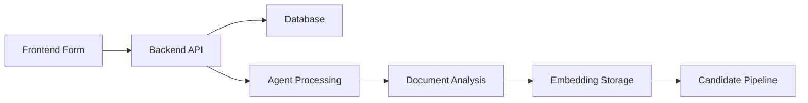

# HireMau Recruitment Pipeline Integration Guide

## ✅ **What's Been Completed**

### 1. **Database Schema (Simplified)**
- ✅ Removed AI fields that frontend doesn't use
- ✅ Added essential fields that match frontend forms
- ✅ Created proper relationships (event_jobs, job_applications)
- ✅ Fixed constraint violations

### 2. **Frontend Form Enhancement**
- ✅ Added essential candidate fields:
  - Current position, years experience
  - Education, experience summary
  - Availability, preferred work type
  - Salary expectations, LinkedIn/GitHub URLs
- ✅ Form now collects real data instead of hardcoded values

### 3. **Simplified Agent Processing**
- ✅ Created `add_candidate_simplified.py`
- ✅ Processes PDF and image documents
- ✅ Stores analysis in `company_table` (existing embedding infrastructure)
- ✅ Runs on port 5001

### 4. **Simplified Backend Service**
- ✅ Created `candidate_service_simplified.py`
- ✅ Integrates frontend → database → agent workflow
- ✅ Handles job applications and candidate processing

## 🔄 **Complete Integration Flow**



### **Flow Details:**
1. **Frontend** collects candidate data + files
2. **Backend** creates candidate record in database
3. **Agent** processes documents (resume, certificates)
4. **AI Analysis** extracts candidate information
5. **Storage** saves analysis as embeddings in company_table
6. **Pipeline** shows candidates in recruitment stages

## 🚀 **How to Run the Complete System**

### **Step 1: Apply Database Schema**
```sql
-- In Supabase SQL Editor, run:
-- Copy content from: new_backend/SIMPLIFIED_SCHEMA.sql
```

### **Step 2: Start the Simplified Agent**
```powershell
cd agent
python add_candidate_simplified.py
# Runs on http://localhost:5001
```

### **Step 3: Start the Backend (Updated)**
Update your main router to use the simplified service:

```python
# In new_backend/routers/candidates_router.py
from services.candidate_service_simplified import SimplifiedCandidateService

candidate_service = SimplifiedCandidateService()

@router.post("/candidates/create_with_processing")
async def create_candidate_with_processing(
    candidate_data: dict,
    files: List[dict] = None
):
    return await candidate_service.create_candidate_with_processing(
        candidate_data, files
    )
```

### **Step 4: Update Frontend Service**
Update `frontend/src/services/candidateService.ts` to call the new endpoint:

```typescript
export const createCandidateWithProcessing = async (formData: FormData) => {
  const response = await fetch('http://localhost:8001/candidates/create_with_processing', {
    method: 'POST',
    body: formData
  });
  return response.json();
};
```

## 📊 **Testing the Pipeline**

### **Test Case 1: Basic Candidate Creation**
1. Fill out the enhanced candidate form
2. Upload a resume PDF
3. Submit form
4. Check database: candidate record created
5. Check agent logs: document processed
6. Check company_table: analysis stored

### **Test Case 2: Job Application Flow**
1. Create candidate with event_id and job_id
2. Verify job_applications table has record
3. Update candidate stage to "screening"
4. Verify job_applications.status updated

### **Test Case 3: AI Analysis Retrieval**
1. Query company_table for candidate analysis
2. Filter by metadata->candidate_id
3. Extract AI insights for candidate matching

## 🔍 **Database Verification**

```sql
-- Check candidates
SELECT id, name, email, stage, status, created_at FROM candidates ORDER BY created_at DESC LIMIT 10;

-- Check job applications
SELECT c.name, j.title, ja.status, ja.applied_at 
FROM job_applications ja
JOIN candidates c ON ja.candidate_id = c.id
JOIN jobs j ON ja.job_id = j.id
ORDER BY ja.applied_at DESC;

-- Check AI analysis (stored in company_table)
SELECT content, metadata 
FROM company_table 
WHERE metadata->>'document_type' = 'candidate_analysis' 
ORDER BY (metadata->>'processed_at')::timestamp DESC;
```

## 🎯 **Key Benefits of Simplified Approach**

### **Frontend Benefits:**
- ✅ Form collects meaningful data
- ✅ Fields match database schema
- ✅ Malaysian context (MYR, local preferences)
- ✅ File upload with validation

### **Backend Benefits:**
- ✅ Single service handles complete workflow
- ✅ Proper error handling and logging
- ✅ Integrates with existing Supabase structure
- ✅ Reuses company_table for embeddings

### **Agent Benefits:**
- ✅ Simplified document processing
- ✅ Works with PDFs and images
- ✅ Stores analysis for retrieval
- ✅ No dependency on dropped tables

### **Pipeline Benefits:**
- ✅ End-to-end candidate tracking
- ✅ Job application workflow
- ✅ Stage progression management
- ✅ AI-powered candidate insights

## 🔧 **Troubleshooting**

### **Agent Not Processing:**
- Check agent is running on port 5001
- Verify GOOGLE_API_KEY in environment
- Check file URLs are accessible

### **Database Errors:**
- Verify SIMPLIFIED_SCHEMA.sql was executed
- Check Supabase connection credentials
- Validate candidate data format

### **Frontend Issues:**
- Check form validation
- Verify API endpoint URLs
- Test file upload limits

## 📈 **Next Steps**

1. **Test Integration**: Run through complete pipeline
2. **Add Validation**: Enhance error handling
3. **UI Polish**: Improve candidate display
4. **Performance**: Optimize database queries
5. **Monitoring**: Add logging and metrics

This simplified approach gets you a **working recruitment pipeline** that:
- Collects real candidate data
- Processes documents with AI
- Stores everything properly
- Shows candidates in the pipeline
- Works within your 3-hour timeline!

## 🎉 **Ready to Test!**

Run the system and test with a real candidate:
1. Open frontend candidate form
2. Fill in candidate details
3. Upload a resume
4. Submit and watch the magic happen!

The complete flow should work: **Frontend → Database → Agent → Analysis → Pipeline Display** 